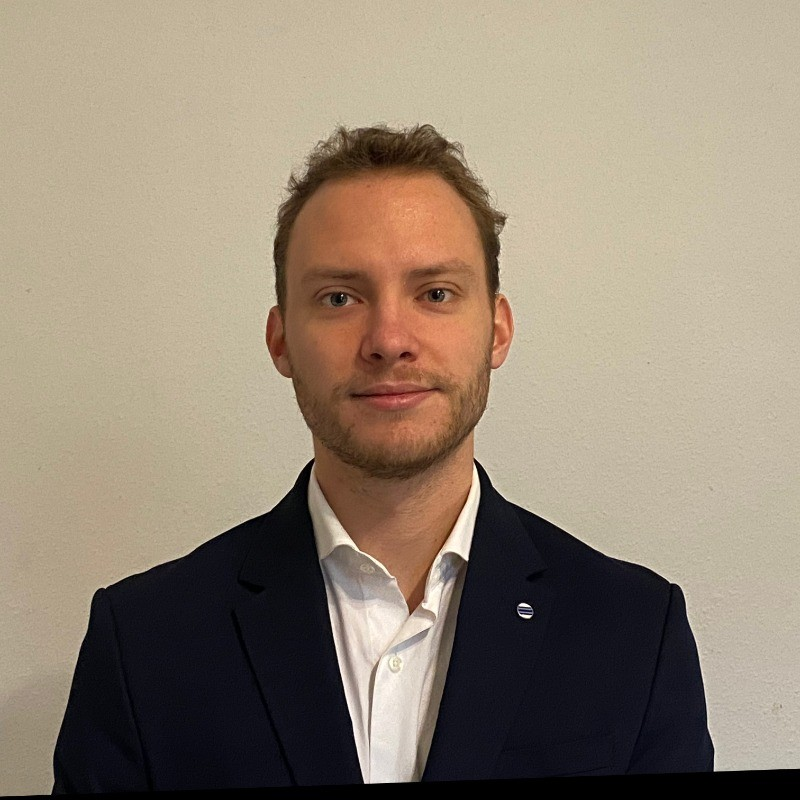

Hi, I'm Maxime Delobel.  
I study applied informatics at HoGent while previously having obtained a Master's Degree in Biomedical Sciences majoring Neuroscience at the University of Ghent.  
I created this blog to document my learning process and share insights as I explore cybersecurity. My goal is to provide clear, beginner-friendly notes that can help others who are just starting out. I hope these posts make the journey into cybersecurity more approachable and encourage others to keep learning.

[Go to the Home Page]({{ '/' | absolute_url }})
